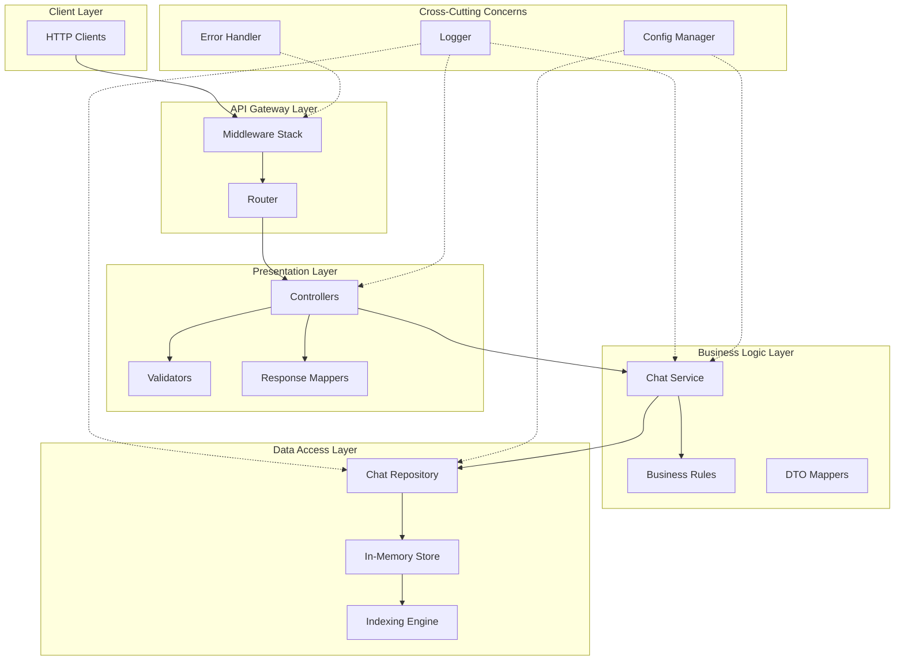
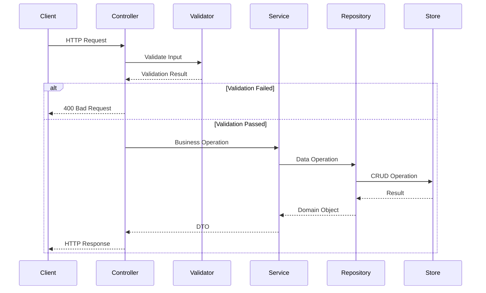
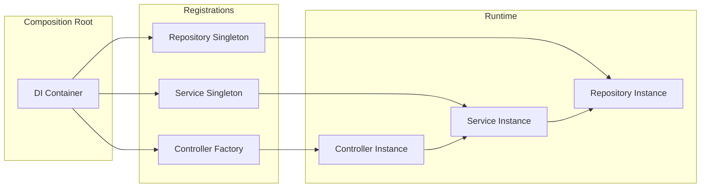
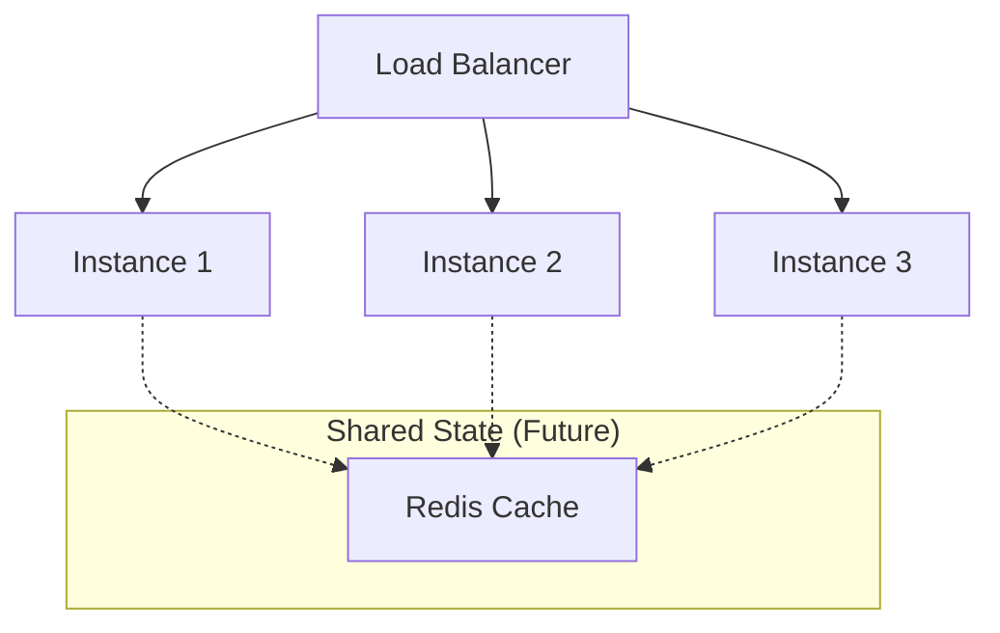
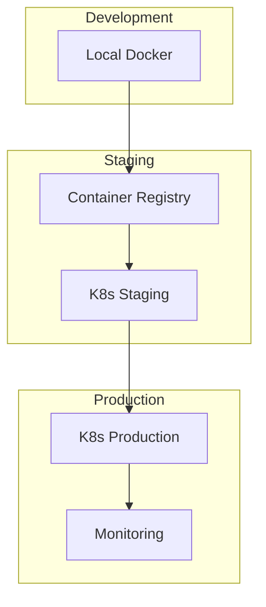

# TypeScript Chat Management System API - System Architecture

## Architecture Overview

The Chat Management System API follows a layered architecture pattern with clear separation of concerns and well-defined module boundaries. Each layer has specific responsibilities and communicates through defined interfaces.



## Module Structure

```
chat-management-system/
├── src/
│   ├── app.ts                    # Application entry point
│   ├── server.ts                 # HTTP server configuration
│   │
│   ├── config/                   # Configuration module
│   │   ├── index.ts             # Config aggregator
│   │   ├── app.config.ts        # Application settings
│   │   └── constants.ts         # Application constants
│   │
│   ├── api/                     # API Layer
│   │   ├── routes/              # Route definitions
│   │   │   ├── index.ts
│   │   │   └── chat.routes.ts
│   │   ├── controllers/         # Request handlers
│   │   │   └── chat.controller.ts
│   │   ├── validators/          # Input validation
│   │   │   └── chat.validator.ts
│   │   └── middleware/          # Express middleware
│   │       ├── error.middleware.ts
│   │       ├── validation.middleware.ts
│   │       └── logging.middleware.ts
│   │
│   ├── core/                    # Core business logic
│   │   ├── services/            # Business services
│   │   │   └── chat.service.ts
│   │   ├── models/              # Domain models
│   │   │   └── chat.model.ts
│   │   └── interfaces/          # Core interfaces
│   │       ├── chat.interface.ts
│   │       └── repository.interface.ts
│   │
│   ├── infrastructure/          # Infrastructure layer
│   │   ├── repositories/        # Data access
│   │   │   └── chat.repository.ts
│   │   ├── store/              # In-memory storage
│   │   │   ├── memory-store.ts
│   │   │   └── store.interface.ts
│   │   └── cache/              # Caching layer (future)
│   │       └── cache.interface.ts
│   │
│   ├── common/                  # Shared utilities
│   │   ├── errors/             # Custom error classes
│   │   │   ├── base.error.ts
│   │   │   ├── validation.error.ts
│   │   │   └── not-found.error.ts
│   │   ├── utils/              # Utility functions
│   │   │   ├── id-generator.ts
│   │   │   └── validators.ts
│   │   ├── types/              # TypeScript types
│   │   │   ├── dto.types.ts
│   │   │   └── common.types.ts
│   │   └── decorators/         # Custom decorators
│   │       └── validation.decorator.ts
│   │
│   └── tests/                   # Test files
│       ├── unit/
│       ├── integration/
│       └── fixtures/
│
├── package.json
├── tsconfig.json
├── .env.example
└── README.md
```

## Module Boundaries and Responsibilities

### 1. API Layer (`/api`)
**Responsibility**: HTTP request/response handling
- **Controllers**: Process HTTP requests, delegate to services
- **Routes**: Define API endpoints and map to controllers
- **Validators**: Validate request payloads
- **Middleware**: Cross-cutting concerns (auth, logging, errors)

**Boundaries**:
- ✅ Can import from: `core/interfaces`, `common/*`
- ❌ Cannot import from: `infrastructure/*`
- Communicates with Core layer via service interfaces

### 2. Core Layer (`/core`)
**Responsibility**: Business logic and domain rules
- **Services**: Orchestrate business operations
- **Models**: Define domain entities
- **Interfaces**: Define contracts for dependencies

**Boundaries**:
- ✅ Can import from: `common/*`
- ❌ Cannot import from: `api/*`, `infrastructure/*` (except interfaces)
- Uses dependency injection for infrastructure dependencies

### 3. Infrastructure Layer (`/infrastructure`)
**Responsibility**: External systems and data persistence
- **Repositories**: Data access abstraction
- **Store**: In-memory data storage implementation
- **Cache**: Performance optimization (future)

**Boundaries**:
- ✅ Can import from: `core/interfaces`, `common/*`
- ❌ Cannot import from: `api/*`, `core/services`
- Implements interfaces defined in Core layer

### 4. Common Layer (`/common`)
**Responsibility**: Shared utilities and cross-cutting concerns
- **Errors**: Custom error types
- **Utils**: Helper functions
- **Types**: Shared TypeScript types

**Boundaries**:
- ❌ Cannot import from any other layer
- Can be imported by all layers

## Data Flow Architecture



## Component Interfaces

### Repository Interface
```typescript
interface IRepository<T> {
  findAll(filters?: FilterOptions): Promise<PaginatedResult<T>>
  findById(id: string): Promise<T | null>
  create(data: CreateDTO): Promise<T>
  update(id: string, data: UpdateDTO): Promise<T | null>
  delete(id: string): Promise<boolean>
}
```

### Service Interface
```typescript
interface IChatService {
  getAllChats(filters: ChatFilters): Promise<PaginatedChats>
  getChatById(id: string): Promise<ChatDTO>
  createChat(data: CreateChatDTO): Promise<ChatDTO>
  updateChat(id: string, data: UpdateChatDTO): Promise<ChatDTO>
  deleteChat(id: string): Promise<void>
  toggleChatStatus(id: string): Promise<ChatDTO>
}
```

### Store Interface
```typescript
interface IMemoryStore<T> {
  get(key: string): T | undefined
  set(key: string, value: T): void
  has(key: string): boolean
  delete(key: string): boolean
  clear(): void
  size(): number
  values(): T[]
}
```

## Dependency Injection Architecture



## Error Handling Architecture

```typescript
// Error Hierarchy
BaseError
├── ValidationError (400)
├── NotFoundError (404)
├── ConflictError (409)
└── InternalError (500)

// Error Flow
Controller -> try/catch -> Error Middleware -> Error Response
```

## Security Architecture

### Input Validation Pipeline


### Security Boundaries
1. **Input Validation**: All inputs validated at API layer
2. **Sanitization**: HTML/Script injection prevention
3. **Rate Limiting**: Configurable per-endpoint limits
4. **Error Masking**: Internal errors never exposed to clients

## Performance Architecture

### Caching Strategy (Future)
```typescript
interface CacheStrategy {
  key: string
  ttl: number
  invalidation: 'time-based' | 'event-based'
}
```

### Indexing Strategy
- Primary Index: Map by ID (O(1) lookup)
- Secondary Indexes (future):
  - Priority Index: Map<Priority, Set<ChatId>>
  - Active Status Index: Map<boolean, Set<ChatId>>

## Scalability Considerations

### Horizontal Scaling Pattern


### Vertical Scaling
- Memory optimization for 10K+ chat sessions
- Connection pooling (when DB added)
- Worker threads for CPU-intensive operations

## Configuration Management

```typescript
// Environment-based configuration
interface AppConfig {
  port: number              // from PORT env
  environment: string       // from NODE_ENV
  logLevel: string         // from LOG_LEVEL
  maxChats: number         // from MAX_CHATS
  rateLimit: {
    windowMs: number
    maxRequests: number
  }
}
```

## Testing Architecture

### Test Pyramid
```
         /\
        /  \  E2E Tests (5%)
       /    \
      /------\ Integration Tests (25%)
     /        \
    /----------\ Unit Tests (70%)
```

### Test Boundaries
- **Unit Tests**: Test individual modules in isolation
- **Integration Tests**: Test module interactions
- **E2E Tests**: Test complete user flows

## Monitoring & Observability

### Logging Strategy
```typescript
interface LogContext {
  requestId: string
  userId?: string
  operation: string
  duration: number
  error?: Error
}
```

### Metrics Collection
- Request/Response times
- Error rates by endpoint
- Memory usage
- Active chat session count

## Development Principles

1. **SOLID Principles**
   - Single Responsibility: Each module has one reason to change
   - Open/Closed: Extensible via interfaces
   - Liskov Substitution: Implementations are interchangeable
   - Interface Segregation: Small, focused interfaces
   - Dependency Inversion: Depend on abstractions

2. **Clean Architecture**
   - Dependencies point inward
   - Business logic is framework-agnostic
   - External concerns are pluggable

3. **12-Factor App**
   - Config via environment variables
   - Stateless processes
   - Dev/prod parity

## Module Communication Patterns

### Request/Response Pattern
```typescript
// Controller -> Service -> Repository -> Store
async function getChat(id: string): Promise<ChatDTO> {
  const chat = await service.getChatById(id)
  return mapToDTO(chat)
}
```

### Event-Driven Pattern (Future)
```typescript
// EventEmitter for decoupled communication
eventBus.on('chat:created', async (chat) => {
  await auditLog.record('CREATE', chat)
  await cache.invalidate('chats:*')
})
```

## Deployment Architecture



## Technology Stack

- **Runtime**: Node.js 18+ with TypeScript 5+
- **Framework**: Express.js 4.x
- **Validation**: Joi/Zod for schema validation
- **Testing**: Jest + Supertest
- **Logging**: Winston/Pino
- **Documentation**: OpenAPI/Swagger
- **Build**: ESBuild/SWC for fast compilation
- **Linting**: ESLint + Prettier
- **Container**: Docker with multi-stage builds