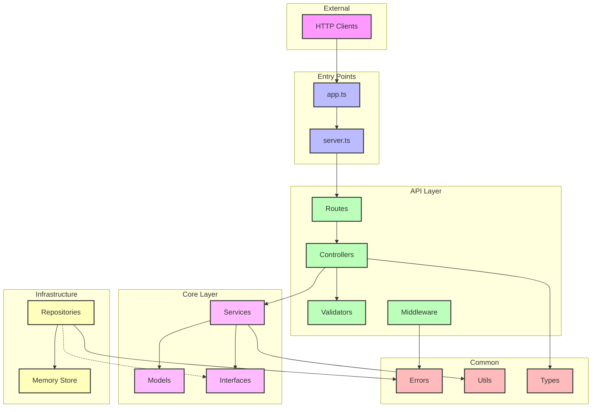

# Module Boundaries and Dependency Rules

## Dependency Flow Diagram



## Module Import Rules

### ✅ Allowed Dependencies

| Module | Can Import From | Purpose |
|--------|----------------|---------|
| **app.ts** | config/, api/routes, api/middleware, common/errors | Application bootstrap |
| **server.ts** | app.ts, config/ | Server initialization |
| **api/routes** | api/controllers, api/middleware | Route registration |
| **api/controllers** | core/services, api/validators, common/*, core/interfaces | Request handling |
| **api/validators** | common/types, common/utils | Input validation |
| **api/middleware** | common/errors, common/utils | Cross-cutting concerns |
| **core/services** | core/models, core/interfaces, common/* | Business logic |
| **core/models** | common/types | Domain entities |
| **core/interfaces** | common/types | Contract definitions |
| **infrastructure/repositories** | core/interfaces, infrastructure/store, common/* | Data access |
| **infrastructure/store** | common/types | Storage implementation |
| **common/*** | None (leaf modules) | Shared utilities |

### ❌ Forbidden Dependencies

| Module | Cannot Import From | Reason |
|--------|-------------------|---------|
| **core/*** | api/*, infrastructure/* | Core should not depend on external layers |
| **api/controllers** | infrastructure/* | Controllers should use services, not repositories directly |
| **common/*** | Any other module | Common utilities must be independent |
| **core/interfaces** | infrastructure/* | Interfaces define contracts, not implementations |
| **infrastructure/repositories** | api/*, core/services | Infrastructure implements core interfaces |

## Module Interfaces and Contracts

### API Layer Contracts

```typescript
// api/controllers/chat.controller.ts
interface IChatController {
  getAll(req: Request, res: Response): Promise<void>
  getById(req: Request, res: Response): Promise<void>
  create(req: Request, res: Response): Promise<void>
  update(req: Request, res: Response): Promise<void>
  delete(req: Request, res: Response): Promise<void>
  toggle(req: Request, res: Response): Promise<void>
}

// api/validators/chat.validator.ts
interface IChatValidator {
  validateCreate(data: unknown): CreateChatDTO
  validateUpdate(data: unknown): UpdateTodoDTO
  validateFilters(query: unknown): TodoFilters
}
```

### Core Layer Contracts

```typescript
// core/interfaces/service.interface.ts
interface IService<T, CreateDTO, UpdateDTO> {
  findAll(filters?: FilterOptions): Promise<PaginatedResult<T>>
  findById(id: string): Promise<T>
  create(data: CreateDTO): Promise<T>
  update(id: string, data: UpdateDTO): Promise<T>
  delete(id: string): Promise<void>
}

// core/interfaces/repository.interface.ts
interface IRepository<T> {
  findAll(filters?: FilterOptions): Promise<T[]>
  findById(id: string): Promise<T | null>
  create(entity: T): Promise<T>
  update(id: string, entity: Partial<T>): Promise<T | null>
  delete(id: string): Promise<boolean>
  count(filters?: FilterOptions): Promise<number>
}
```

### Infrastructure Layer Contracts

```typescript
// infrastructure/store/store.interface.ts
interface IMemoryStore<T> {
  get(key: string): T | undefined
  set(key: string, value: T): void
  has(key: string): boolean
  delete(key: string): boolean
  clear(): void
  size(): number
  entries(): IterableIterator<[string, T]>
  values(): IterableIterator<T>
}

// infrastructure/cache/cache.interface.ts (future)
interface ICache {
  get<T>(key: string): Promise<T | null>
  set<T>(key: string, value: T, ttl?: number): Promise<void>
  delete(key: string): Promise<void>
  flush(): Promise<void>
}
```

## Dependency Injection Configuration

```typescript
// src/config/dependencies.ts
import { Container } from 'inversify'

const container = new Container()

// Bind interfaces to implementations
container.bind<ITodoService>(TYPES.TodoService)
  .to(TodoService)
  .inSingletonScope()

container.bind<ITodoRepository>(TYPES.TodoRepository)
  .to(TodoRepository)
  .inSingletonScope()

container.bind<IMemoryStore<Todo>>(TYPES.MemoryStore)
  .to(MemoryStore)
  .inSingletonScope()

export { container }
```

## Module Communication Patterns

### 1. Controller → Service → Repository

```typescript
// Correct: Controller uses Service
class TodoController {
  constructor(private todoService: ITodoService) {}
  
  async getAll(req: Request, res: Response) {
    const todos = await this.todoService.findAll(req.query)
    res.json(todos)
  }
}

// Wrong: Controller bypasses Service
class TodoController {
  constructor(private todoRepository: ITodoRepository) {} // ❌
  
  async getAll(req: Request, res: Response) {
    const todos = await this.todoRepository.findAll() // ❌
    res.json(todos)
  }
}
```

### 2. Service → Repository Interface

```typescript
// Correct: Service depends on interface
class TodoService {
  constructor(private repository: ITodoRepository) {}
  
  async findAll(filters: TodoFilters) {
    return this.repository.findAll(filters)
  }
}

// Wrong: Service depends on concrete implementation
class TodoService {
  constructor(private repository: TodoRepository) {} // ❌
}
```

### 3. Repository → Store

```typescript
// Correct: Repository uses Store abstraction
class TodoRepository implements ITodoRepository {
  constructor(private store: IMemoryStore<Todo>) {}
  
  async findById(id: string): Promise<Todo | null> {
    return this.store.get(id) || null
  }
}

// Wrong: Repository creates its own store
class TodoRepository {
  private store = new Map() // ❌ Should be injected
}
```

## Module Initialization Order

```mermaid
graph LR
    subgraph "1. Bootstrap"
        CONFIG[Load Config]
        ENV[Validate Env]
    end
    
    subgraph "2. Infrastructure"
        STORE[Create Store]
        REPO[Create Repositories]
    end
    
    subgraph "3. Core"
        SVC[Create Services]
        RULES[Load Business Rules]
    end
    
    subgraph "4. API"
        MW[Setup Middleware]
        ROUTES[Register Routes]
        CTRL[Create Controllers]
    end
    
    subgraph "5. Server"
        APP[Create App]
        LISTEN[Start Server]
    end
    
    CONFIG --> ENV
    ENV --> STORE
    STORE --> REPO
    REPO --> SVC
    SVC --> RULES
    RULES --> MW
    MW --> CTRL
    CTRL --> ROUTES
    ROUTES --> APP
    APP --> LISTEN
```



## Module Testing Boundaries

### Unit Test Boundaries
Each module should be tested in isolation with mocked dependencies:

```typescript
// Testing a Service (mocking Repository)
describe('TodoService', () => {
  let service: TodoService
  let mockRepository: jest.Mocked<ITodoRepository>
  
  beforeEach(() => {
    mockRepository = createMockRepository()
    service = new TodoService(mockRepository)
  })
  
  test('should call repository.findAll', async () => {
    await service.findAll({})
    expect(mockRepository.findAll).toHaveBeenCalled()
  })
})
```

### Integration Test Boundaries
Test module interactions with real implementations:

```typescript
// Testing Controller → Service → Repository flow
describe('Todo API Integration', () => {
  let app: Application
  let store: IMemoryStore<Todo>
  
  beforeEach(() => {
    store = new MemoryStore()
    const repository = new TodoRepository(store)
    const service = new TodoService(repository)
    app = createApp(service)
  })
  
  test('GET /todos returns todos', async () => {
    const response = await request(app).get('/todos')
    expect(response.status).toBe(200)
  })
})
```

## Module Configuration

### Environment-Based Configuration

```typescript
// config/app.config.ts
export interface AppConfig {
  api: {
    port: number
    prefix: string
    rateLimit: {
      windowMs: number
      max: number
    }
  }
  store: {
    maxItems: number
    ttl?: number
  }
  logging: {
    level: 'debug' | 'info' | 'warn' | 'error'
    format: 'json' | 'simple'
  }
}

// Module-specific config access
class TodoService {
  constructor(
    private repository: ITodoRepository,
    private config: AppConfig['store']
  ) {}
}
```

## Module Naming Conventions

### File Naming
- **Controllers**: `*.controller.ts`
- **Services**: `*.service.ts`
- **Repositories**: `*.repository.ts`
- **Models**: `*.model.ts`
- **Interfaces**: `*.interface.ts`
- **Validators**: `*.validator.ts`
- **Middleware**: `*.middleware.ts`
- **Utils**: `*.util.ts`
- **Types**: `*.types.ts`
- **Tests**: `*.test.ts` or `*.spec.ts`

### Class/Interface Naming
- **Interfaces**: Prefix with `I` (e.g., `ITodoService`)
- **Abstract Classes**: Prefix with `Abstract` (e.g., `AbstractRepository`)
- **Implementations**: Descriptive name (e.g., `TodoService`, `MemoryStore`)
- **DTOs**: Suffix with `DTO` (e.g., `CreateTodoDTO`)
- **Errors**: Suffix with `Error` (e.g., `ValidationError`)

## Module Size Constraints

### File Size Limits
- **Maximum lines per file**: 500
- **Maximum functions per file**: 10
- **Maximum imports**: 15

### Module Splitting Guidelines
When a module exceeds size limits, split by:
1. **Responsibility**: Separate concerns into different files
2. **Feature**: Group related functionality
3. **Layer**: Keep layer boundaries clear

Example split:
```
// Before: todo.service.ts (600+ lines)
TodoService
  - CRUD operations
  - Validation logic
  - Business rules
  - Event handling

// After split:
todo.service.ts (200 lines) - Orchestration
todo-crud.service.ts (150 lines) - CRUD ops
todo-rules.service.ts (150 lines) - Business rules
todo-events.service.ts (100 lines) - Event handling
```

## Module Documentation

Each module should include:

```typescript
/**
 * @module TodoService
 * @description Handles business logic for Todo operations
 * @dependencies ITodoRepository, IEventBus
 * @implements ITodoService
 */
export class TodoService implements ITodoService {
  /**
   * Creates a new TodoService instance
   * @param repository - Data access layer
   * @param eventBus - Event publishing
   */
  constructor(
    private readonly repository: ITodoRepository,
    private readonly eventBus?: IEventBus
  ) {}
}
```